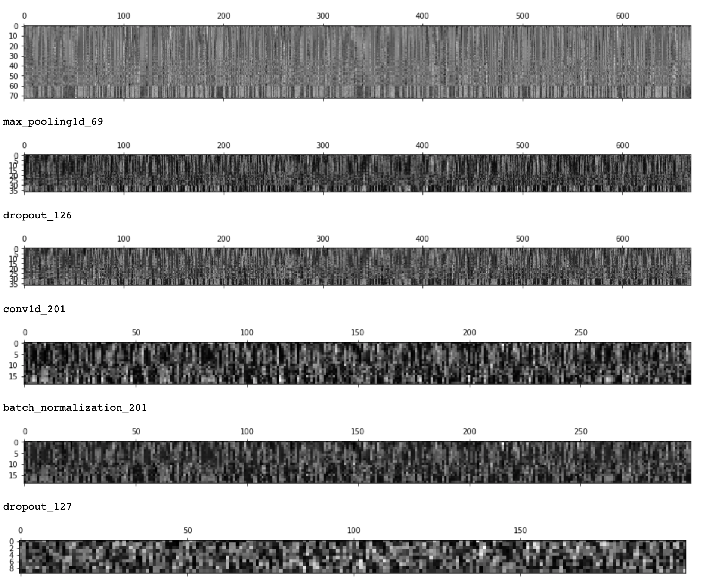
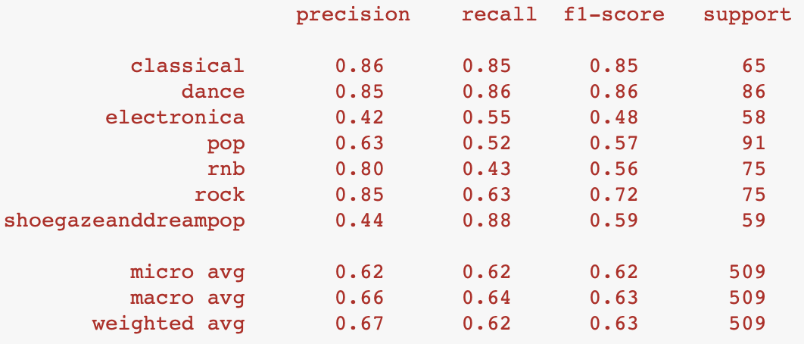

### Seven/Four: Music Genre Prediction and Audio Sample Recommendation

Website up live now at http://13.229.98.76:8080 ! (Optimised for desktop usage viewing)

Please refer to the PDF slides (seven_four_capstone.pdf) for further details.

This is a project that helps musicians seeking to find audio samples via a song genre prediction.

Please check requirements.txt for the running of the main Jupyter notebook (seven_four.ipynb).

Please check requirements_working_file.txt for the running of the full project Jupyter notebook (seven_four_working_file.ipynb)

### Why Seven/Four?

Seven/Four (stylised as 7/4) is an uncommon and unique time signature notation that indicates having 7 beats in a bar, instead of the common 4/4 time signature.

### What does Seven/Four do?

Seven/Four is a music genre prediction & sample recommendation system.


Its aim is to provide musicians an all-in-one method to obtain royalty-free audio samples related to the genre of a track selected. The samples can then be used in a digital audio workstation.

Seven/Four checks what a user wants to listen to via the artist input, and then it will proceed to ask for album and track before hitting Spotify's API to
obtain the 30s preview URL.

The library module, Librosa, proceeds to convert these into Mel-spectrograms before running it through the Conv1D neural network.

The neural network currently runs 3 convolution layers and a dense layer to predict across 7 genres.

The genre will recommend 5 audio samples derived from Freesound's API, which is ready for downloading and usage.

Mel-spectrogram image:

Example of CNN layers output (including dropout and batch normalisation):

The current accuracy is 0.6915.

Here's the current classification metrics report:

The blurred boundaries between Pop and R&B has caused much problems for the model in determining which genre between the 2, does a song belong to. My current assumption is that, due to the widespread usage of electronic music production as well as the evolution of music styles through time, this has really brought both genres much closer sonically, as compared to, say, the early 90's.

Sample pool needs to be increased as well, and try to create a balanced data set so that the model can be trained better.

These will be worked on as the project is still ongoing.

### The Long Read

If you've read this far and have gotten curious as to how this all came about, here's a wall of text discussing it all.

You've been warned! 

Seven/Four is a capstone project done during General Assembly (Singapore)'s Data Science Immersive program by yours truly, Alvin Tham. It originally started out as an exploratory experiment with the knowledge that I was gaining daily, as well as my love for music, through the gruelling bootcamp. The experiment started to flesh itself out and I realised eventually that this project of labour was something that I really wanted to work on and present as my capstone project.

At the very start, the only piece I had was being able to hit Spotify's API as we had just covered APIs in class.
This initial piece was what sparked everything off, as I started to check out Spotify's API functions, and then eventually use
Last.FM's API as well for practice. At this point in time, a subtle notion started forming in my mind: Predicting music genres.

Initially, I used specific features and getting the mean and standard deviation of these features, with a total of 13 features.

These included signal zero crossing rate, amplitude, beats per minute, Mel-frequency cepstral coefficients (MFCCs), spectral centroids, root mean square values of each sample.

Unfortunately, even though the accuracy for various models (logistic regression, random forest, KNN, using PCA as well) were decent for 7 categories (0.65), it had very poor recall scores. Iterating through many model variations, gathering more samples, selecting/de-selecting features, didn't seem to improve the scores (at times, deproving the score).

That's when I decided to try my hand at a neural network.

As I was a keen follower of Google's Tensorflow and it so happened that Tensorflow 2.0 Beta was released, I thought to myself, 
hey, here's an opportunity to try and learn it whilst doing something that was in my mind. Considering that Tensorflow 2.0
Beta was easier to learn with Keras being adopted as its high level API, I decided to put everything I had within me to proceed with music genre prediction. Carpe diem!

The initial network was actually a CRNN network, but it was difficult to train, was computationally intensive, and overfitted very quickly. Swapping out the RNN for a LSTM led to slightly better results, but was still very difficult to train. This was when Tensorboard was really useful in tracking the model's scores in real-time. I decided to cut out the RNN/LSTM portions to keep things simple, fast, and start from ground up again. This ultimately led to scores improving to just below 0.70 accuracy, with a good classification metric result.

Here's a brief timeline of what transpired during the neural network training:

- Read a lot of research papers
- Read a lot on audio signal processing
- Researched on the neural network architectures used in aforementioned research papers
- Decided to obtain my own samples instead of using datasets from Kaggle, by way of Spotify
- Decided to create and train my own neural network instead of using pre-trained models
- Many long nights curating and obtaining Spotify playlists to train the model for 7 genres
- Many long nights iterating through various audio features and extractions
- Many long nights training and adjusting my neural network
- Decided to deploy the model, which meant learning back-end and front-end development
- Putting together the back and front end, deploying to AWS EC2 via Docker container

Admittedly the website isn't that that great looking, but it's enough for now to serve its purpose.

This project will continue to be developed and worked on!
